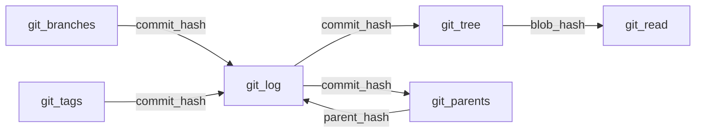

# Duck Tails Database Reference Manual

## Overview

Duck Tails provides virtual tables that expose Git repository data through SQL. These are not persistent tables but rather **table functions** that query Git repositories in real-time using libgit2. Each function call reads directly from the Git object database (.git directory).

## Table Functions

### 1. git_tree Table

**Purpose:** Lists all files and directories in a Git repository at a specific revision.

**Source:** Reads from Git tree objects using libgit2's tree walking API.

**Columns:**

| Column | Type | Description | Source |
|--------|------|-------------|--------|
| `path` | VARCHAR | File path relative to repository root | Git tree entry name, concatenated with parent paths |
| `mode` | VARCHAR | Git file mode (e.g., '100644') | Git tree entry filemode |
| `type` | VARCHAR | Entry type: 'blob' or 'tree' | Git object type |
| `size` | BIGINT | File size in bytes (-1 for directories) | Git blob size or -1 for trees |
| `blob_hash` | VARCHAR | SHA-1 hash of the file content | Git blob OID |
| `commit_hash` | VARCHAR | Full SHA-1 of the commit | Resolved commit OID |
| `commit_time` | TIMESTAMP | When the commit was created | Git commit timestamp |
| `commit_message` | VARCHAR | Full commit message | Git commit message |
| `commit_author` | VARCHAR | Author name and email | Git commit author signature |
| `repo_path` | VARCHAR | Absolute path to repository | Discovered repository root |
| `git_file_uri` | VARCHAR | URI to access this specific file | Constructed as `git://<repo>/<path>@<commit>` |

**Data Flow:**
1. Repository discovery: Walks up directory tree to find .git
2. Reference resolution: Converts ref (HEAD, branch, tag) to commit SHA
3. Tree walking: Recursively traverses Git tree objects
4. Metadata enrichment: Fetches commit details for context

### 2. git_log Table

**Purpose:** Returns commit history for a repository.

**Source:** Git commit objects traversed via libgit2's revwalk API.

**Columns:**

| Column | Type | Description | Source |
|--------|------|-------------|--------|
| `commit_hash` | VARCHAR | Full SHA-1 commit hash | Git commit OID |
| `short_hash` | VARCHAR | Abbreviated commit hash (7 chars) | First 7 chars of OID |
| `author_name` | VARCHAR | Commit author's name | Git author signature |
| `author_email` | VARCHAR | Commit author's email | Git author signature |
| `author_time` | TIMESTAMP | When authored (may differ from commit) | Git author timestamp |
| `committer_name` | VARCHAR | Who created the commit | Git committer signature |
| `committer_email` | VARCHAR | Committer's email | Git committer signature |
| `commit_time` | TIMESTAMP | When committed to repository | Git commit timestamp |
| `message` | VARCHAR | Full commit message | Git commit message field |
| `subject` | VARCHAR | First line of commit message | Split at first newline |
| `body` | VARCHAR | Message after first line | Everything after subject |
| `parents` | VARCHAR[] | Array of parent commit hashes | Git commit parent OIDs |
| `tree_hash` | VARCHAR | Root tree object hash | Git commit tree OID |
| `repo_path` | VARCHAR | Absolute path to repository | Discovered repository root |
| `uri` | VARCHAR | Git URI for this commit | Constructed as `git://<repo>@<commit>` |

**Data Flow:**
1. Initialize revwalk at specified ref
2. Walk commit history (respects ranges like `main..feature`)
3. For each commit, extract all metadata
4. Parse message into subject/body

### 3. git_branches Table

**Purpose:** Lists all branches in a repository.

**Source:** Git reference database via libgit2's branch iterator.

**Columns:**

| Column | Type | Description | Source |
|--------|------|-------------|--------|
| `branch_name` | VARCHAR | Short branch name | Git reference shorthand |
| `full_name` | VARCHAR | Full reference path | Git reference name (refs/heads/...) |
| `commit_hash` | VARCHAR | SHA-1 of branch tip | Git reference target OID |
| `commit_time` | TIMESTAMP | Timestamp of tip commit | Resolved commit timestamp |
| `commit_message` | VARCHAR | Message of tip commit | Resolved commit message |
| `is_head` | BOOLEAN | True if current branch | Comparison with HEAD reference |
| `is_remote` | BOOLEAN | True if remote branch | Reference type check |
| `remote_name` | VARCHAR | Remote name (if remote branch) | Parsed from reference name |
| `upstream` | VARCHAR | Upstream branch name | Git branch upstream configuration |
| `repo_path` | VARCHAR | Absolute path to repository | Discovered repository root |

**Data Flow:**
1. Iterate over all references matching refs/heads/* and refs/remotes/*
2. For each branch, resolve to commit
3. Check if branch matches current HEAD
4. Extract upstream tracking information from config

### 4. git_tags Table

**Purpose:** Lists all tags in a repository.

**Source:** Git reference database and tag objects via libgit2.

**Columns:**

| Column | Type | Description | Source |
|--------|------|-------------|--------|
| `tag_name` | VARCHAR | Short tag name | Git reference shorthand |
| `full_name` | VARCHAR | Full reference path | Git reference name (refs/tags/...) |
| `commit_hash` | VARCHAR | SHA-1 of tagged commit | Peeled tag target OID |
| `commit_time` | TIMESTAMP | Timestamp of tagged commit | Resolved commit timestamp |
| `commit_message` | VARCHAR | Message of tagged commit | Resolved commit message |
| `tag_message` | VARCHAR | Annotated tag message | Git tag object message |
| `tagger_name` | VARCHAR | Who created the tag | Git tag tagger signature |
| `tagger_email` | VARCHAR | Tagger's email | Git tag tagger signature |
| `tag_time` | TIMESTAMP | When tag was created | Git tag timestamp |
| `is_annotated` | BOOLEAN | True if annotated tag | Object type check |
| `repo_path` | VARCHAR | Absolute path to repository | Discovered repository root |

**Data Flow:**
1. Iterate over all references matching refs/tags/*
2. For lightweight tags: directly resolve to commit
3. For annotated tags: read tag object, then resolve to commit
4. Extract tagger information if available

### 5. git_read Table

**Purpose:** Reads file content from a repository at a specific revision.

**Source:** Git blob objects via libgit2.

**Columns:**

| Column | Type | Description | Source |
|--------|------|-------------|--------|
| `path` | VARCHAR | File path within repository | User-provided or parsed from URI |
| `blob_hash` | VARCHAR | SHA-1 of file content | Git blob OID |
| `size_bytes` | BIGINT | File size in bytes | Git blob size |
| `content` | BLOB | Raw file content | Git blob content |
| `text` | VARCHAR | UTF-8 text (if valid) | Blob content if UTF-8 decodable |
| `repo_path` | VARCHAR | Absolute path to repository | Discovered repository root |
| `revision` | VARCHAR | Resolved revision | Resolved commit SHA |
| `git_file_uri` | VARCHAR | URI to this file version | Constructed as `git://<repo>/<path>@<revision>` |

**Data Flow:**
1. Parse file path and revision from input
2. Resolve revision to commit
3. Navigate tree to find file entry
4. Load blob content
5. Attempt UTF-8 decode for text field

### 6. git_parents Table

**Purpose:** Returns parent commits for commits in a repository.

**Source:** Git commit parent references via libgit2.

**Columns:**

| Column | Type | Description | Source |
|--------|------|-------------|--------|
| `commit_hash` | VARCHAR | Hash of the commit | Git commit OID |
| `parent_hash` | VARCHAR | Hash of the parent commit | Git parent OID |
| `parent_index` | INTEGER | Parent index (0-based) | Parent array position |

**Data Flow:**
1. Resolve input ref to commit range or single commit
2. For each commit, iterate through parent OIDs
3. Return parent relationships

**Variants:**
- `git_parents(repo_path, ref, all_refs)` - Static function for querying parents
- `git_parents_each(repo_path, ref)` - LATERAL join variant for column references

## Table Relationships

### Primary Keys
- `git_tree`: (`repo_path`, `commit_hash`, `path`)
- `git_log`: (`repo_path`, `commit_hash`)
- `git_branches`: (`repo_path`, `branch_name`)
- `git_tags`: (`repo_path`, `tag_name`)
- `git_read`: (`repo_path`, `revision`, `path`)
- `git_parents`: (`commit_hash`, `parent_hash`, `parent_index`)

### Foreign Key Relationships



### Common Join Patterns

```sql
-- Files changed in a commit
SELECT t.path, t.size, l.commit_message
FROM git_log('.') l
JOIN git_tree('.', l.commit_hash) t ON TRUE
WHERE l.commit_hash = 'abc123';

-- Branch history
SELECT b.branch_name, l.*
FROM git_branches('.') b
JOIN git_log('.', b.branch_name) l ON TRUE;

-- Tag releases with file counts
SELECT t.tag_name, COUNT(tr.path) as file_count
FROM git_tags('.') t
JOIN LATERAL git_tree('.', t.commit_hash) tr ON TRUE
GROUP BY t.tag_name;

-- Merge commits (multiple parents)
SELECT l.commit_hash, COUNT(p.parent_hash) as parent_count
FROM git_log('.') l
LEFT JOIN LATERAL git_parents(l.commit_hash) p ON TRUE
GROUP BY l.commit_hash
HAVING COUNT(p.parent_hash) > 1;
```

## Data Sources and libgit2 APIs

### Repository Discovery
- **API**: `git_repository_discover()`
- **Process**: Searches for .git directory up the tree
- **Cache**: Repository paths are cached per query

### Object Reading
- **Trees**: `git_tree_walk()` for recursive traversal
- **Commits**: `git_commit_lookup()` for metadata
- **Blobs**: `git_blob_lookup()` for file content
- **Tags**: `git_tag_lookup()` for annotated tags

### Reference Resolution
- **Branches**: `git_branch_iterator_new()`
- **Tags**: `git_tag_foreach()`
- **Symbolic refs**: `git_reference_resolve()`

### History Walking
- **Revwalk**: `git_revwalk_new()` and `git_revwalk_push()`
- **Ranges**: Two-dot (`A..B`) uses hide/push
- **Parents**: `git_commit_parent()` for ancestry

## Performance Characteristics

### Time Complexity
- `git_tree`: O(n) where n = number of files
- `git_log`: O(m) where m = commits in range
- `git_branches`: O(b) where b = number of branches
- `git_tags`: O(t) where t = number of tags
- `git_read`: O(1) for single file
- `git_parents`: O(p) where p = parent count (usually 1-2)

### Memory Usage
- File content loaded entirely into memory
- Large repositories may consume significant RAM
- No streaming support for blobs

### Caching
- Repository discovery cached per query
- No caching of Git objects between queries
- Each function call reopens the repository

## Limitations

1. **Read-only**: Cannot modify repositories
2. **Local only**: No remote repository support
3. **No submodules**: Submodules treated as directories
4. **Binary files**: Limited support (returned as BLOB)
5. **Large files**: Must fit in memory
6. **No shallow clones**: Requires full repository

## Error Conditions

- **Not a git repository**: Directory not in a Git repo
- **Invalid reference**: Branch/tag/commit doesn't exist
- **Path not found**: File doesn't exist at revision
- **Permission denied**: No read access to repository
- **Corrupted repository**: Invalid Git objects

## Best Practices

1. **Use specific refs**: Avoid HEAD in automated queries
2. **Limit results**: Use LIMIT for large repositories
3. **Filter early**: Use WHERE on paths/branches
4. **Join carefully**: LATERAL joins can be expensive
5. **Cache results**: Store in tables for repeated analysis